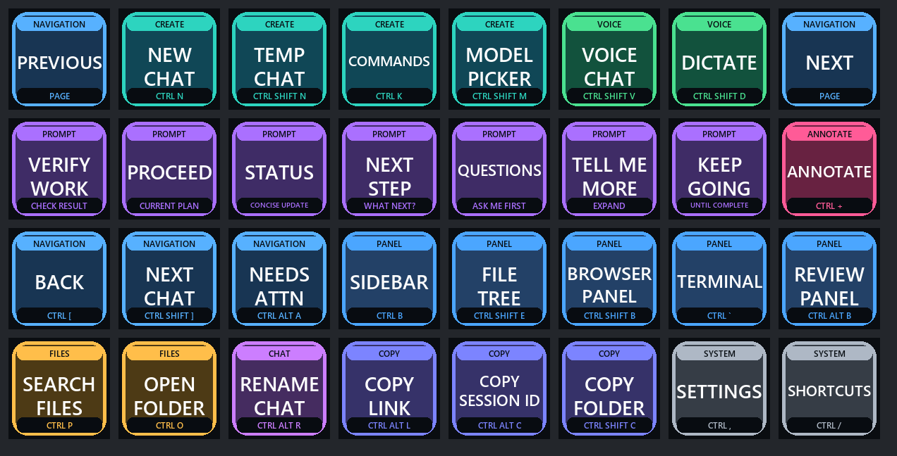

# Codex Control Page for Stream Deck XL

A readable, color-coded Stream Deck XL control page for the Codex Windows app. It combines 23 Codex keyboard shortcuts with seven reusable workflow prompts, plus page navigation.



## What it includes

- New Chat, Temporary Chat, command menu, model picker, voice chat, and dictation
- Reusable prompts such as Proceed, Verify Work, Status, and Keep Going
- Chat, file, browser, terminal, sidebar, and review navigation
- Annotate, settings, shortcut help, and copy commands
- Large labels designed to remain readable on physical Stream Deck keys

## Requirements

- Windows 10 or Windows 11
- Elgato Stream Deck XL with Stream Deck 7.1 or newer
- The Codex Windows app

This layout is made for the Stream Deck XL's 8 by 4 key grid. It does not currently resize for smaller Stream Deck models.

## Install

1. Download `Codex-Stream-Deck-Control-Page-v1.0.0.zip` from the latest GitHub Release.
2. Extract the ZIP file.
3. Double-click **Install Codex Control Page.cmd**.
4. If Stream Deck is open, close it when the installer asks and then press Enter.
5. Stream Deck reopens on the new **Codex Controls** page.

The installer adds a new page to the Stream Deck XL Default Profile. If a page named **Codex Controls** is already present, the installer updates that page. It does not replace another page.

Before making any change, the installer copies the complete selected Stream Deck profile to:

```text
Documents\Codex Stream Deck Control Page Backups
```

## Important behavior

The hotkey buttons act on the currently focused application. The prompt buttons type text and press Enter. Keep Codex focused when using this page so a prompt is not typed into another application.

The shortcuts were verified against the Codex Windows app in August 2026. Application updates may change individual shortcuts. The **SHORTCUTS** key opens Codex's current shortcut list.

## Restore a backup

1. Close Stream Deck.
2. Open `Documents\Codex Stream Deck Control Page Backups`.
3. Open the timestamped backup created immediately before installation.
4. Copy the `.sdProfile` folder back into `%APPDATA%\Elgato\StreamDeck\ProfilesV3`, replacing the matching profile.
5. Reopen Stream Deck.

Restoring a complete profile also restores every other page to the state it had when that backup was created.

## Customize

Edit [`layout.json`](layout.json) to change labels, shortcuts, or reusable prompts. Run `python scripts/render-buttons.py` after visual changes. The rendering script requires Pillow and is intended for contributors; ordinary installation does not require Python or Node.js.

## Disclaimer

This is an independent community project. It is not affiliated with, endorsed by, or supported by OpenAI or Elgato. Use it at your own risk and keep the automatic backup until you have tested every key.

## License

MIT. See [`LICENSE`](LICENSE).
